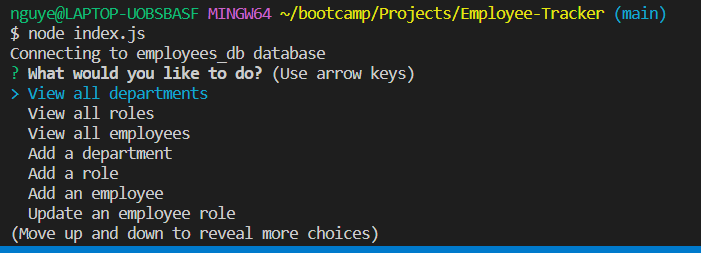
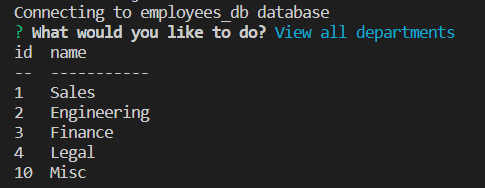
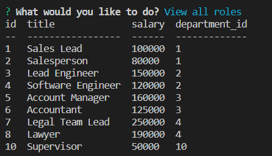
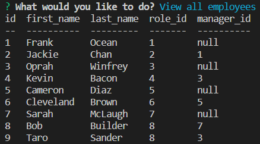
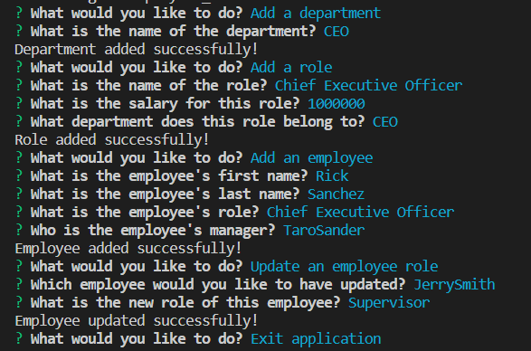

# Employee Tracker

## Description
 - The employee tracker application is a tool designed to help businesses keep track of their employees' information, including their names, positions, and salaries. The application provides a centralized location for all the employee data, making it easy to manage and update as needed. With this tool, businesses can quickly access employee information, such as position and salary, to ensure that their workforce is aligned with their budget and goals. The employee tracker application also helps businesses stay organized, making it a valuable asset for any company.
## License 
 - MIT License
## Tech Used
 - Javascript
 - Inquirer
 - Node.js
 - MySQL
 - MySQL2 Node Package
## Usage
 - This application is designed to keep track of employees, their positions and salaries. It provides an easy and efficient way for businesses to manage their workforce by organizing and storing employee information in one place. This information can be quickly accessed and updated, ensuring that the company has an up-to-date record of their employees and their roles.
## Installation
 - Open terminal
 - Type npm install into terminal
 - Type node index.js
 - Select item from list
 - Select exit when ready to close application
## Contributors
 - Veroneca Sander
## Challenges
 - Getting the separate queries to work similarly yet with a small difference was very difficult
 - Had alot of errors in the adjusting of the queries
## Contact Info
 - Github - @Vtsander
 - Email - nguyenveroneca@yahoo.com
## Photos of Project
 - 
 - 
 - 
 - 
 - 
 
 